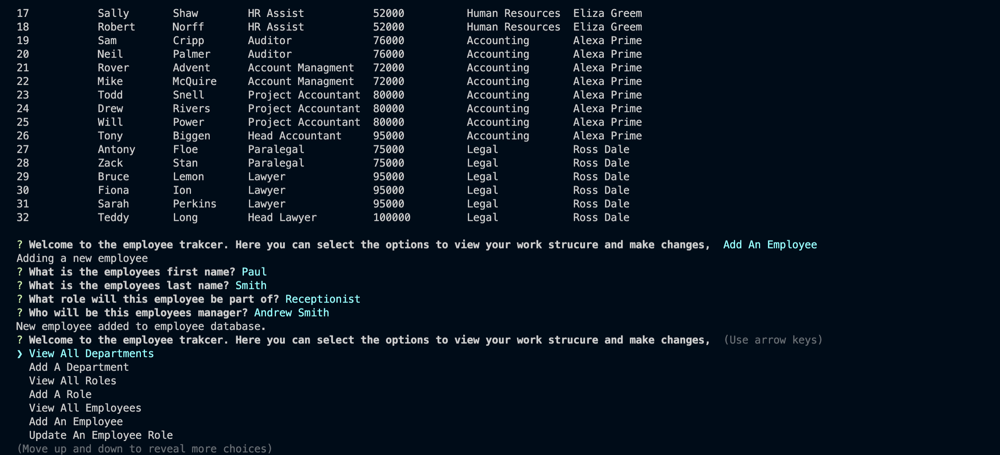

# SQL Employee-Tracker

## Description
Developers frequently have to create interfaces that allow non-developers to easily view and interact with information stored in databases. These interfaces are called content management systems (CMS). This week we were tasked to build a command-line application from scratch to manage a company's employee database, using Node.js, Inquirer, and MySQL. 

This was another imporant excercise as it was an opportunity to implement the skills and knowledge we had learnt over the past week about MySQL. In addition it provided another platform for the continue development of Node.js and the dependency 'inquirer'. 

To see how the application works click on [View Application Demo.](https://drive.google.com/file/d/1MHcRjpFbJ4NTBQccByAA3axjDpGUfd4s/view)

## Table of Contents 
- [Installation](#installation)
- [Usage](#usage)
- [Features](#features)

## Installation
Once the user has cloned the project from GitHub there are a few steps they must undertake in order to get the application running. 
First, open the command line and then type in 'npm install' or 'npm i'. This will download the neccessary dependencies so that the application functions. 
Secondly, right click on 'server.js' and open the 'integrated terminal'. Once this is open the user can input node server.js to begin the application.  

## Usage
Once the user has installed all the neccessary dependencies and opened the command terminal (as per the notes in installation) they will be presented with a note "connected to the employees_db database". 
They will also see a welcome note, followed by a list of options which the application can undertake. 

The user can select what they want to do, for example to view all deparmtnets. 

The user may then decide they want to add a new department, they can then select "Add A Department" and answer the prompted questions. Once they have finised the questions, a note will appear " Added A New Department", 
the user can then re-select "View All Departments" and will see the new department has been added to the department table. 

For example we can add a new deparment "Reception" and then re select view all deparments and see it has been added. 

The same principles apply to View All Roles / Add A Role as well as View All Employees / Add An Employee. 

A new role (Receptionist) can be added to our newly created department (Reception). 

The user can select to view all employees and will be presented with a table featuring all employees in the company as well as other critical data (employee ID, First Name, Last Name, Role, Annual Salary, Department Name, and who their Manager is

The user can then add an employee to the database. For example lets add our new recptionist to the database. Once all questions are answered the employee will be added to the database.

 

Lastly, the user can update an employee role. An employee may need to move into another role within the company. 
For example Sarah Perkins has been prompted from Head Lawyer, and the table needs to reflect this change. 

Once this has been updated, the user can then view the employee table and see the change. 

Once the user is satisfied, they can select Exit, which will stop the applicatin. 

## Features
- Node.js
- Inquirer
- MySQL 
- Figlet 
- console.table 
- dotenv 
